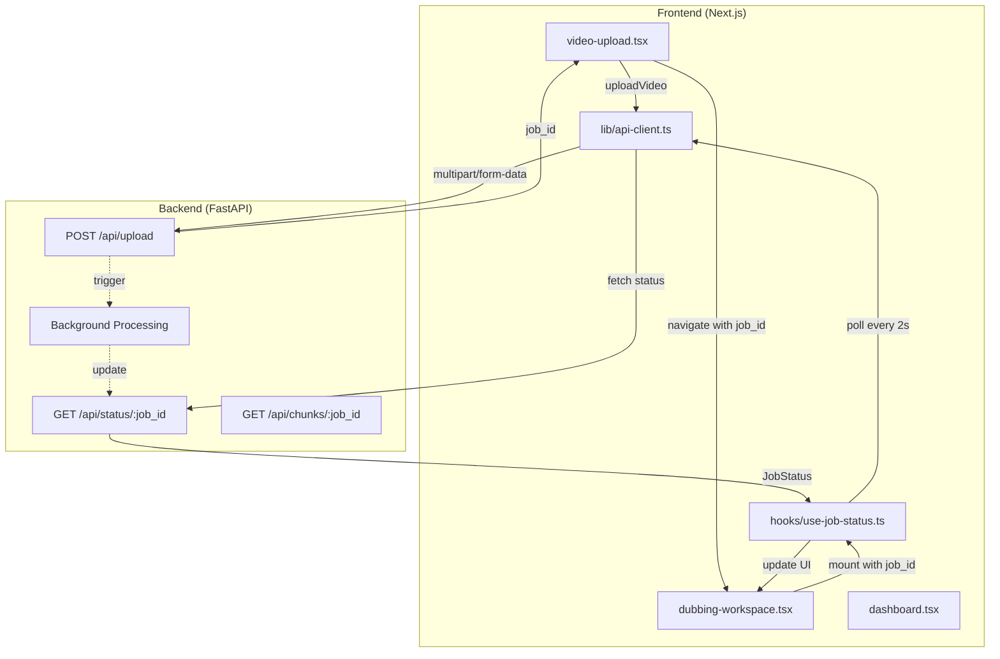
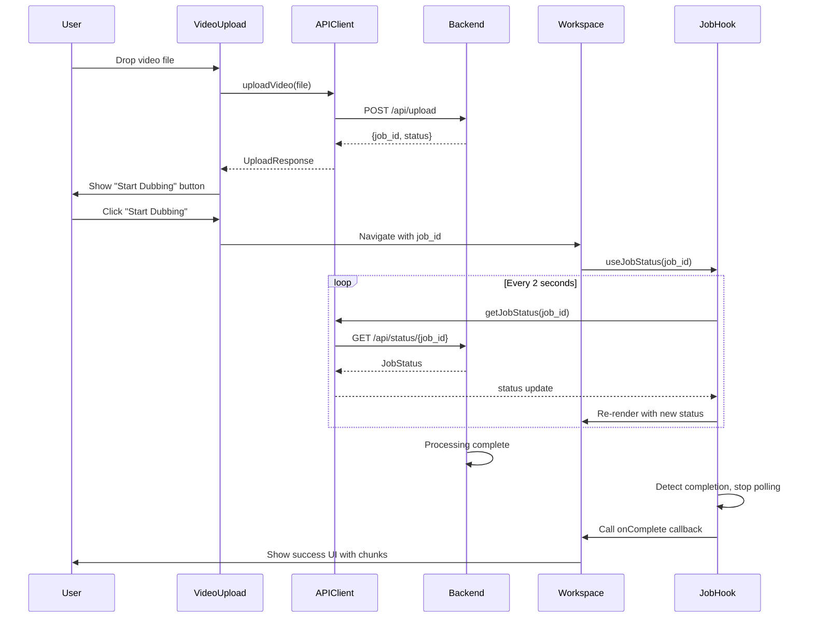

# Frontend-Backend Integration Plan

## Objective
Wire the Dubverse Next.js frontend to the FastAPI backend, replacing mock data flows with real API calls for video upload, processing status polling, and chunk retrieval.

## Current State Assessment

**Backend (FastAPI)**
- Running at `http://localhost:8000`
- Endpoints operational: `/api/upload`, `/api/status/{job_id}`, `/api/chunks/{job_id}`
- CORS configured for frontend origin
- Background processing pipeline with job state management

**Frontend (Next.js)**
- Components using simulated/mock upload flows
- No live API integration
- Integration files prepared but not deployed:
  - `api-client-for-frontend.ts` (TypeScript API client)
  - `use-job-status-for-frontend.ts` (polling hook)
  - `env.local` (environment variables)

**Gap**: Frontend components not connected to backend APIs.

---

## Integration Architecture



---

## Implementation Steps

### Phase 1: Deploy Integration Foundation

**1.1 Create API Client Module**
- **File**: `Dubverse Frontend/lib/api-client.ts`
- **Source**: Copy from `api-client-for-frontend.ts`
- **Purpose**: Centralized API communication layer
- **Key exports**:
  - `apiClient` singleton instance
  - Type definitions: `UploadResponse`, `JobStatus`, `ChunkInfo`
  - Utilities: `validateVideoFile`, `formatFileSize`, `getStatusMessage`

**1.2 Create Job Status Hook**
- **File**: `Dubverse Frontend/hooks/use-job-status.ts`
- **Source**: Copy from `use-job-status-for-frontend.ts`
- **Purpose**: Automatic status polling with lifecycle management
- **Features**:
  - Polls every 2 seconds (configurable)
  - Auto-stops on completion/failure
  - Callbacks for `onComplete` and `onError`

**1.3 Configure Environment**
- **File**: `Dubverse Frontend/.env.local`
- **Content**:
  ```
  NEXT_PUBLIC_API_URL=http://localhost:8000
  ```
- **Note**: Ensure `.env.local` is gitignored

---

### Phase 2: Update Video Upload Component

**File**: `Dubverse Frontend/components/video-upload.tsx`

**2.1 Add Imports**
```typescript
import { apiClient, validateVideoFile } from "@/lib/api-client"
import { useToast } from "@/hooks/use-toast"
```

**2.2 Replace Mock Upload Function**
- **Remove**: `simulateUpload` function (mock progress simulation)
- **Add**: `uploadToBackend` async function that:
  1. Validates file using `validateVideoFile`
  2. Calls `apiClient.uploadVideo(file, onProgress)`
  3. Updates local state with real progress
  4. Handles errors with toast notifications
  5. Stores backend `job_id` in uploaded file state

**2.3 Update Drop Handler**
- Replace `simulateUpload` calls with `uploadToBackend`
- Pass original `File` object from `acceptedFiles`

**2.4 Update Start Dubbing Handler**
- Ensure `video.id` passed to workspace is the backend `job_id`
- Preserve file metadata for preview

---

### Phase 3: Update Dubbing Workspace Component

**File**: `Dubverse Frontend/components/dubbing-workspace.tsx`

**3.1 Add Imports**
```typescript
import { useJobStatus } from "@/hooks/use-job-status"
import { getStatusMessage } from "@/lib/api-client"
```

**3.2 Integrate Status Polling**
```typescript
const { status, loading, error } = useJobStatus({
  jobId: video.id,  // backend job_id from upload
  pollInterval: 2000,
  onComplete: (finalStatus) => {
    // Show success notification
  },
  onError: (errorMessage) => {
    // Show error notification
  }
})
```

**3.3 Implement Status-Driven UI**
- **Loading state**: Spinner while initial connection
- **Error state**: Display error with back button
- **Processing state** (`pending`/`processing`):
  - Show progress bar (0-100%)
  - Display current stage message
  - Show video preview if available
- **Completed state**:
  - Success banner
  - Display chunk count and segments
  - Show chunk timeline (start/end times)

**3.4 Remove Mock Data Dependencies**
- Replace any hardcoded status checks with `status.status` checks
- Use `status.progress`, `status.current_stage`, `status.chunks` from API

---

### Phase 4: Update Dashboard (Optional)

**File**: `Dubverse Frontend/components/dashboard.tsx`

**4.1 Add Job Listing** (if needed)
- Call `apiClient.listJobs()` on mount
- Display recent jobs from backend instead of/alongside mock data
- Show real status indicators

---

## Data Flow Diagram



---

## Testing & Verification Strategy

### Unit-Level Verification

**API Client Tests**
- File validation logic (size limits, format checks)
- Error handling for network failures
- Progress callback invocation

**Hook Tests**
- Polling starts on mount
- Polling stops on completion/failure
- Cleanup on unmount prevents memory leaks

### Integration Testing Flow

**Test Case 1: Successful Upload & Processing**
1. Start backend: `cd "Dubverse Backend" ; python -m uvicorn app.main:app --reload`
2. Start frontend: `cd "Dubverse Frontend" ; npm run dev`
3. Open browser to `http://localhost:3000`
4. Upload small test video (2-3 min, MP4 format)
5. **Verify**: Progress bar shows real upload progress (0-100%)
6. **Verify**: "Start Dubbing" button appears after upload
7. Click "Start Dubbing"
8. **Verify**: Workspace shows processing status
9. **Verify**: Status updates every 2 seconds (check Network tab)
10. **Verify**: Progress advances through stages (uploading → chunking → extracting → transcribing → diarizing → completed)
11. **Verify**: Final UI shows chunk count and segments
12. **Verify**: Browser console shows no errors

**Test Case 2: File Validation**
1. Attempt upload with 6GB file
2. **Verify**: Error toast: "File size exceeds 5GB limit"
3. Attempt upload with `.txt` file
4. **Verify**: Error toast: "Invalid format..."

**Test Case 3: Error Handling**
1. Stop backend while video processing
2. **Verify**: Frontend shows connection error
3. **Verify**: Polling stops after error
4. Restart backend
5. **Verify**: New uploads work correctly

**Test Case 4: Multiple Jobs**
1. Upload video A, start dubbing
2. Navigate back to dashboard
3. Upload video B, start dubbing
4. **Verify**: Both jobs process independently
5. **Verify**: Correct job status shown in each workspace

### Acceptance Criteria

- [ ] Video uploads show real progress (not simulated)
- [ ] Backend assigns unique `job_id` for each upload
- [ ] Workspace polls backend every 2 seconds
- [ ] UI updates reflect actual processing stages
- [ ] Progress bar matches backend progress percentage
- [ ] Polling stops when job completes or fails
- [ ] Error states display meaningful messages
- [ ] No CORS errors in browser console
- [ ] No memory leaks (polling cleanup verified)
- [ ] Multiple concurrent uploads work correctly
- [ ] File validation prevents invalid uploads

---

## Rollback Plan

If integration causes issues:

1. **Preserve originals**: Copy current `video-upload.tsx` and `dubbing-workspace.tsx` to `.backup` files before editing
2. **Incremental rollback**: Remove imports and restore mock functions
3. **Delete integration files**: Remove `lib/api-client.ts`, `hooks/use-job-status.ts`, `.env.local`
4. **Restart dev server**: Clear Next.js cache if needed

---

## Dependencies & Prerequisites

**Backend Prerequisites**
- FastAPI server running on `localhost:8000`
- CORS configured for `http://localhost:3000`
- Storage directories initialized
- Required Python packages installed (ffmpeg-python, etc.)

**Frontend Prerequisites**
- Next.js dev server available
- `lib/` and `hooks/` directories exist
- Toast notification system configured (`@/hooks/use-toast`)
- TypeScript configured

**System Prerequisites**
- FFmpeg installed and in system PATH
- Node.js v18+ and npm
- Python 3.10+

---

## Risk Mitigation

| Risk | Mitigation |
|------|------------|
| CORS errors block API calls | Verify backend `CORS_ORIGINS` includes frontend URL; check browser console for specific CORS errors |
| Polling doesn't stop, causing memory leaks | Hook cleanup tested; `useEffect` dependencies reviewed; `isMountedRef` guards state updates |
| Large file uploads timeout | Backend chunk reading (1MB blocks) prevents memory issues; frontend shows progress; consider upload timeout config |
| Backend crash during processing | Frontend shows error state; implement retry logic in future iteration; job status persists |
| Type mismatches between frontend/backend | TypeScript interfaces match backend Pydantic models; validate with sample responses |

---

## Post-Integration Enhancements (Future Scope)

- WebSocket for real-time status updates (replace polling)
- Resume interrupted uploads
- Chunk preview/playback in workspace
- Batch upload support
- Progress persistence across page refresh
- Download processed chunks
- Job history and re-processing

---

## File Change Summary

| Action | File | Purpose |
|--------|------|---------|
| Create | `Dubverse Frontend/lib/api-client.ts` | API communication layer |
| Create | `Dubverse Frontend/hooks/use-job-status.ts` | Status polling hook |
| Create | `Dubverse Frontend/.env.local` | Backend URL configuration |
| Modify | `Dubverse Frontend/components/video-upload.tsx` | Replace mock upload with real API |
| Modify | `Dubverse Frontend/components/dubbing-workspace.tsx` | Add status polling and dynamic UI |
| Optional | `Dubverse Frontend/components/dashboard.tsx` | Show real job list |

---

## Definition of Done

Integration is complete when:

1. All files created/modified per plan
2. TypeScript compilation succeeds (no type errors)
3. Frontend dev server starts without errors
4. All test cases pass
5. No console errors during normal operation
6. Real video processes end-to-end (upload → chunking → completion)
7. UI accurately reflects backend state at all times
8. Polling stops correctly on completion/error
9. Error handling works for network failures and invalid files
10. Code reviewed for security (no exposed secrets, proper error handling)